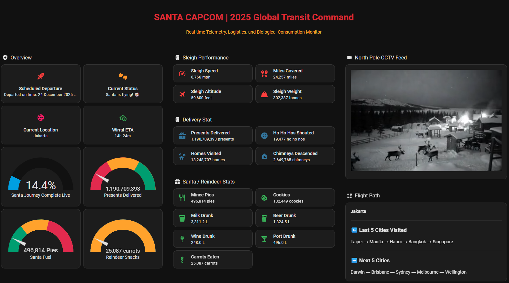

# 🎅 SANTA CAPCOM | 2025 Global Transit Command

A spare time project Home Assistant Santa Tracker that transforms your dashboard into a mission control center tracking Santa's Christmas Eve journey in real-time with live telemetry, logistics monitoring, and AI-generated CCTV footage from the North Pole!



## ✨ Features

### 📡 Real-Time Tracking & Telemetry
- **Live Position Updates**: Santa's current location updates in real-time via Google Santa Tracker API
- **Flight Path Display**: Shows last 5 cities visited and next 5 destinations
- **Journey Progress**: Live percentage completion with ETA calculations
- **Sleigh Performance Metrics**: Speed (6,500-6,950 mph), altitude (~60,000 ft), and weight tracking

### 📊 Comprehensive Statistics
All statistics update **every second** for smooth rolling counter effects:

**Delivery Metrics:**
- 8.25+ billion presents delivered
- 91.8+ million homes visited  
- 18.3+ million chimneys descended
- 168,125+ miles covered

**Refreshment Consumption:**
- 3.4+ million mince pies eaten
- 918,000+ cookies consumed
- 22,957 litres milk drunk (~40,400 pints)
- 9,183 litres beer drunk (~2,426 gallons)
- 1,721 litres wine drunk (~2,214 bottles)
- 3,443 litres port drunk (~4,590 bottles)
- 173,880 carrots eaten by reindeer

**Performance Data:**
- Sleigh weight decrease (350,000 → 20,000 tonnes as presents delivered)
- Ho Ho Hos shouted counter
- Cruising altitude monitoring
- Speed fluctuation tracking

### 🎥 North Pole CCTV Feed
- Looping video player with AI-generated "security camera" footage
- Automatic random video selection and playback
- Seamless transitions between clips
- Creates authentic surveillance camera atmosphere

## 📋 Prerequisites

- Home Assistant installation (2023.1 or newer recommended)
- Access to your Home Assistant configuration files
- Basic understanding of YAML configuration
- Video files for CCTV loop (examples can be generated via AI, or use your own footage)

## 🚀 Installation

### 1. File Structure

Your Home Assistant configuration should have this structure:

```
config/
├── automations/
│   └── cctv_loop_player.yaml
├── templates/
│   └── santa_tracker.yaml
├── configuration.yaml (add REST sensor configuration)
└── www/
    └── media/
        ├── a1.mp4
        ├── a2.mp4
        ├── a3.mp4
        └── ... (additional videos)
```

### 2. Configuration Steps

#### Step 1: Add REST Sensor to configuration.yaml

Add this to your `configuration.yaml` file to connect to the Google Santa Tracker API:

```yaml
rest:
  - resource: "https://santa-api.appspot.com/info?client=web&language=en&fingerprint=&routeOffset=0&streamOffset=0"
    scan_interval: 60
    sensor:
      - name: "Santa Status"
        value_template: "{{ value_json.status }}"
        unique_id: santa_status
      
      - name: "Santa Takeoff Time"
        value_template: "{{ (value_json.takeoff / 1000) | timestamp_custom('%Y-%m-%d %H:%M:%S') }}"
        unique_id: santa_takeoff_time
      
      - name: "Santa Takeoff Time Friendly"
        value_template: "{{ (value_json.takeoff / 1000) | timestamp_custom('%-d %B %Y at %H:%M') }}"
        unique_id: santa_takeoff_time_friendly
      
      - name: "Santa Now Time"
        value_template: "{{ value_json.now }}"
        unique_id: santa_now_time
      
      - name: "Santa Duration"
        value_template: "{{ value_json.duration }}"
        unique_id: santa_duration

      - name: "Santa Current Location"
        value_template: "{{ value_json.location if 'location' in value_json else 'North Pole' }}"
        unique_id: santa_current_location
        json_attributes:
          - location
```

Also add the template configuration:

```yaml
template: !include_dir_merge_list templates
```

#### Step 2: Copy Template Sensors
- Place `santa_tracker.yaml` in your `config/templates/` directory
- This file contains all the calculated sensors for presents, food, drinks, distance, etc.

#### Step 3: Set Up CCTV Loop (Optional)
1. Place `cctv_loop_player.yaml` in your `config/automations/` directory
2. Create the required helper:
   - Go to **Settings → Devices & Services → Helpers**
   - Click **"Create Helper" → Text**
   - Name: `random_video_filename`
   - Leave initial value blank
3. Add video files to `config/www/media/` directory
4. Update the max_val in `cctv_loop_player.yaml` to match your number of videos

#### Step 4: Restart Home Assistant
- **Settings → System → Restart** or use the restart command

### 3. Dashboard Configuration

Create a new dashboard or add to an existing one. The SANTA CAPCOM dashboard uses a combination of:
- **Entity cards** for status displays
- **Gauge cards** for circular metrics (journey progress, presents delivered, pies, carrots)
- **Markdown cards** for formatted text displays
- **Custom button cards** or **mushroom cards** for the sleek dark interface
- **Picture elements** or **iframe cards** for CCTV feed

See the example dashboard YAML in the `dashboard/` folder for the complete configuration.

## 📺 CCTV Video Setup

### Adding Your Videos

The CCTV loop cycles through videos randomly. To add videos:

1. **Prepare your videos**:
   - Format: MP4
   - Naming: `a1.mp4`, `a2.mp4`, `a3.mp4`, etc.
   - Location: `config/www/media/`

2. **Update the automation**:
   - Open `cctv_loop_player.yaml`
   - Find: ``
   - Update to your highest video number (e.g., `` for 34 videos)

### Creating Videos with AI

Generate CCTV-style footage using AI tools like:
- **GROK AI** (X.com/Grok) - Excellent for security camera style footage
- **Runway ML** - Professional video generation
- **Pika Labs** - Quick AI video clips
- **Stable Video Diffusion** - Open source option

**Prompt suggestion**:
```
"Security camera CCTV footage from North Pole showing reindeer in snowy courtyard, 
grainy black and white thermal imaging style, timestamp in corner, motion detected"
```

### Optimizing Videos

Reduce file size and remove audio using ffmpeg:

```bash
ffmpeg -i input.mp4 -an -vf scale=iw/2:-1 output.mp4
```

Options:
- `-an` removes audio
- `-vf scale=iw/2:-1` reduces resolution by half
- Typical result: 70-90% smaller files

## 📊 Available Sensors

### Status & Journey
- `sensor.santa_departure_status` - Departure time/status
- `sensor.santa_journey_status` - Current flight status
- `sensor.santa_journey_complete_live` - Journey completion %
- `sensor.santa_flying_duration` - Time in flight

### Location Tracking
- `sensor.santa_current_city` - Current location
- `sensor.santa_last_cities` - Last 5 cities visited
- `sensor.santa_next_cities` - Next 5 destinations
- `sensor.santa_eta_uk` - UK arrival countdown

### Delivery Statistics (Live Updating)
- `sensor.santa_presents_delivered_live` - Total presents (8.25B max)
- `sensor.santa_homes_visited_live` - Homes visited (91.8M max)
- `sensor.santa_chimneys_descended_live` - Chimneys used (18.4M max)

### Sleigh Performance
- `sensor.santa_sleigh_speed_live` - Current speed (6,500-6,950 mph)
- `sensor.santa_miles_covered_live` - Distance traveled (168,125 max)
- `sensor.santa_altitude_live` - Flight altitude (~60,000 ft)
- `sensor.santa_sleigh_weight_live` - Current weight (350k → 20k tonnes)

### Refreshments Consumed (Live)
- `sensor.santa_mince_pies_eaten_live` - Pies consumed (3.4M max)
- `sensor.santa_cookies_eaten_live` - Cookies eaten (918K max)
- `sensor.santa_milk_drunk_live` - Milk drunk (22,957L / 40,400 pints)
- `sensor.santa_beer_drunk_live` - Beer consumed (9,183L / 2,426 gallons)
- `sensor.santa_wine_drunk_live` - Wine drunk (1,721L / 2,214 bottles)
- `sensor.santa_port_drunk_live` - Port consumed (3,443L / 4,590 bottles)
- `sensor.santa_carrots_eaten_live` - Carrots for reindeer (173,880 max)
- `sensor.santa_ho_ho_hos_live` - Ho Ho Hos shouted

## 🎨 Dashboard Styling

The SANTA CAPCOM theme uses:
- **Dark background** (`#1a1a1a` or similar)
- **Red accent colors** (`#ff0000`, `#cc0000`) for headers
- **Orange/amber colors** (`#ff8c00`) for warnings and highlights
- **Green colors** (`#00ff00`, `#2ecc71`) for success states
- **Card backgrounds**: Dark gray (`#2a2a2a`)
- **Font**: System fonts or custom fonts like "Orbitron" for tech feel

Custom CSS can be added via:
- `card-mod` custom card
- `themes` configuration
- Browser `mod` for advanced styling

## ⚙️ How It Works

### Live Update Mechanism

All "Live" sensors use a **trigger-based template** that fires every second:

```yaml
- trigger:
    - platform: time_pattern
      seconds: "/1"  # Updates every second
  sensor:
    - name: "Santa Presents Delivered Live"
      # ... calculation based on elapsed time
```

This creates smooth, rolling counters rather than minute-by-minute jumps.

### Calculation Methodology

Each metric is calculated based on:
1. **Total journey duration**: 25 hours (90,000 seconds)
2. **Target total**: e.g., 8,252,753,917 presents
3. **Rate per second**: Total ÷ Duration
4. **Current value**: Rate × Elapsed seconds

The sleigh weight decreases proportionally as presents are delivered:
- Start: 350,000 tonnes
- End: 20,000 tonnes (empty sleigh + Santa)

## 🛠️ Troubleshooting

### Sensors Showing "Unknown" or "Unavailable"
- Check that `configuration.yaml` REST sensor is configured
- Verify internet connectivity to santa-api.appspot.com
- Ensure `templates/santa_tracker.yaml` is in the correct location
- Check Home Assistant logs for template errors

### CCTV Not Playing
- Verify video files are in `www/media/` directory
- Check file naming matches `a1.mp4`, `a2.mp4`, etc.
- Ensure `input_text.random_video_filename` helper exists
- Verify automation is enabled

### Counters Not Updating
- Confirm you're using the `_live` sensor versions
- Check that trigger templates are loaded (check Developer Tools → States)
- Verify no YAML syntax errors in santa_tracker.yaml

### Journey Complete Shows 0%
- Santa hasn't taken off yet (check departure status)
- API may not be active (only works on Christmas Eve/Day)
- Check `sensor.santa_status` is returning "OK"

## 🤝 Contributing

Contributions welcome! Areas for improvement:
- Additional dashboard layouts
- More video footage varieties
- Enhanced statistics
- Multi-language support
- Custom notification automations

## 🌐 Community

- **Reddit Discussion**: [r/homeassistant Santa Tracker](https://www.reddit.com/r/homeassistant/comments/1pkq695/santa_tracker/)
- **Home Assistant Forums**: Share your implementations!
- **GitHub Issues**: Report bugs or request features

## 📜 License

This project is provided as-is for personal use. 

**Data Sources:**
- Google Santa Tracker API (© Google)
- Video content should comply with relevant licensing

## 🎅 Credits

- **Google Santa Tracker Team**: Real-time API providing Santa's position
- **GROK AI / X.com**: AI-generated CCTV footage examples
- **Home Assistant Community**: Inspiration and testing
- **Contributors**: Everyone who shares improvements

---

## 🎄 Tips for Christmas Eve

1. **Test before December 24th**: Ensure everything works using test data
2. **Monitor performance**: Live updates every second uses some CPU
3. **Have fun**: Share with family/guests - kids especially love the CCTV feed!
4. **Screenshots**: Capture memorable moments as Santa approaches your area
5. **Notifications**: Set up alerts for when Santa enters your country/region

---

**🎅 Merry Christmas and Happy Tracking! 🎄✨**

*"Ho Ho Ho! Santa's journey is being monitored in real-time from the CAPCOM at the North Pole!"*
